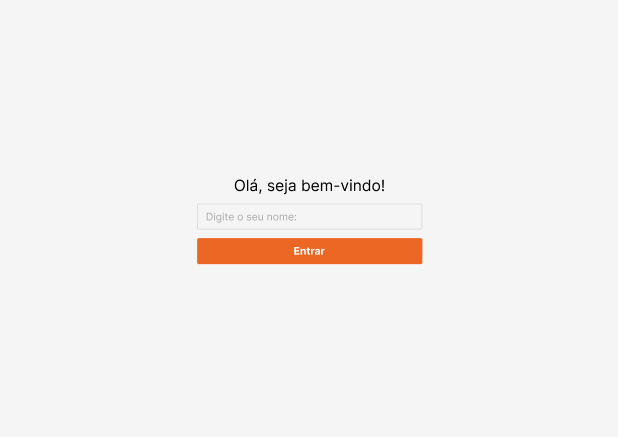
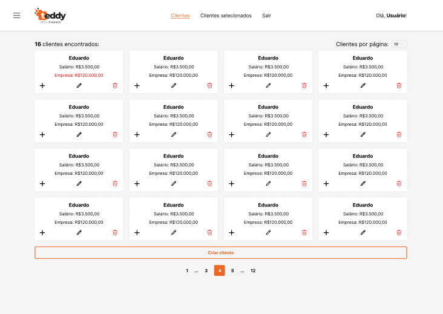

# [NgTeddyApp - https://ng-teddy-app.vercel.app/](https://ng-teddy-app.vercel.app/)

Este projeto foi gerado utilizando [Angular CLI](https://github.com/angular/angular-cli) versão 19.2.3.

<h1 align="center">
  
</h1>

<h4 align="center">
  
  <a href="https://github.com/yuricavalini/ng-teddy-app">
    NgTeddyApp - Concluído 🚀
  </a>
</h4>

<p align="center">
 <a href="#sobre-o-projeto">Sobre</a> •
 <a href="#funcionalidades">Funcionalidades</a> •
 <a href="#layout">Layout</a> •
 <a href="#como-rodar-a-aplicacao">Como rodar a aplicação</a> •
 <a href="#tecnologias">Tecnologias</a> •
 <a href="#autor">Autor</a> •
 <a href="#licença">Licença</a>
</p>

## Sobre o projeto

Este projeto é um sistema de gerenciamento de clientes, desenvolvido com foco na simplicidade e eficiência. Ele permite que os usuários realizem as seguintes operações essenciais:

- Buscar por clientes: facilita a pesquisa e visualização de informações de clientes cadastrados no sistema.
- Criar/cadastrar clientes: permite o registro de novos clientes no banco de dados.
- Editar clientes: oferece a capacidade de editar informações de clientes existentes.
- Excluir clientes: usuários podem remover clientes do sistema quando necessário.
- Selecionar e remover clientes da lista geral: fornece a funcionalidade para selecionar clientes e removê-los da lista principal de forma rápida.
- Login: sistema de autenticação simples para garantir que apenas usuários autorizados acessem as funcionalidades do sistema.

O projeto foi desenvolvido com uma interface intuitiva, garantindo uma experiência de usuário fluída e sem complicações.

---

## Funcionalidades

- [x] Usuários podem:
  - [x] Buscar por clientes;
  - [x] Criar/cadastrar clientes;
  - [x] Editar clientes;
  - [x] Excluir clientes;
  - [x] Selecionar e remover clientes da lista geral de clientes;
  - [x] Realizar login.

---

## Layout

O layout da aplicação está disponível no Figma:

<a href="https://www.figma.com/design/HIy3zEOdvNhK4ysAdNSKXR/Teste-Front-End-Desktop---Teddy?node-id=2-466&p=f&t=RsLJCqDgYEZJUqPw-0">
  
</a>

### Web

<div style="display: flex; flex-direction: column; align-items: center; justify-content: center; gap: 10px">
  
</div>

### Backend

- Acesse: <https://boasorte.teddybackoffice.com.br/docs>

---

## Como rodar a aplicação

Este é um projeto frontend.

### Pré-requisito

Antes de começar, você precisará ter as seguintes ferramentas instaladas em sua máquina:
[Git](https://git-scm.com), [Node.js](https://nodejs.org/en/) (Node.js versão 20.15.0 é o ideal).
Também é bom ter um editor para trabalhar com o código como [VSCode](https://code.visualstudio.com/).

#### Rodando a aplicação web

```bash

# Clone este repositório
$ git clone https://github.com/yuricavalini/ng-teddy-app

# Accesse a pasta do projeto em seu terminal
$ cd ng-teddy-app

# Instale as dependências
$ npm install

# Abra o terminal e execute o servidor em modo de desenvolvimento
$ npx ng serve ou ng serve

# A aplicação irá abrir na port:4200 - vá para http://localhost:4200

```

#### Rodando a aplicação com imagem Docker

```bash

# Instale o docker, crie uma conta no dockerhub e faça login pelo terminal

# Baixe a imagem Docker (https://hub.docker.com/r/yuriwlc/ng-teddy-app-docker)
docker pull yuriwlc/ng-teddy-app-docker

# Rodando a aplicação docker
docker run -p 4200:4200 yuriwlc/ng-teddy-app-docker

# A aplicação irá abrir na port:4200 - vá para http://localhost:4200

```

---

## Tecnologias

Principais ferramentas utilizadas na construção do projeto:

#### **Website** ([Angular 19.2.3](https://angular.dev/) + [TypeScript](https://www.typescriptlang.org/))

> See the full file [package.json](https://github.com/yuricavalini/ng-teddy-app/blob/master/package.json)

**Utilidades**

- Protótipo: **[Figma](https://www.figma.com/)** → **[Protótipo (Ng-Teddy-App)](https://www.figma.com/design/HIy3zEOdvNhK4ysAdNSKXR/Teste-Front-End-Desktop---Teddy?node-id=2-466&p=f&t=RsLJCqDgYEZJUqPw-0")**
- Padronização de projeto e código: **[Eslint](https://eslint.org/)** - **[Commitizen](https://www.npmjs.com/package/commitizen)** - **[Commitlint](https://commitlint.js.org/)** - **[Husky](https://typicode.github.io/husky/#/)** - **[Lint-staged](https://github.com/okonet/lint-staged)** - **[EditorConfig](https://editorconfig.org/)**
- Editor: **[Visual Studio Code](https://code.visualstudio.com/)**

---

## Autor

<div align="center">
  <a href="https://github.com/yuricavalini">
  
  <br />
  <sub><b>Yuri Cavalini</b></sub></a> <a href="https://github.com/yuricavalini" title="Yuri Cavalini">🚀</a>
  <br />
  </a>
</div>
<br />
<div align="center">
  <a title="yuricavalini@gmail.com" href="mailto:yuricavalini@gmail.com?subject=Contact" target="_blank">
    
  </a>
  <a href="https://discordapp.com/users/9585" target="_blank">
    
  </a>
  <a href="https://linkedin.com/in/yuricavalini" target="_blank">
    
  </a>
</div>

---

## Licença

Este projeto está licenciado sob a licença [MIT](./LICENSE).

Feito com ❤️ por Yuri Cavalini 👋🏻 [Contact me!](https://www.linkedin.com/in/yuricavalini/)
